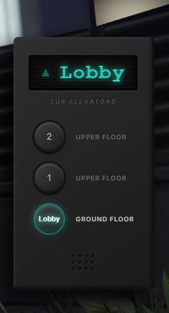
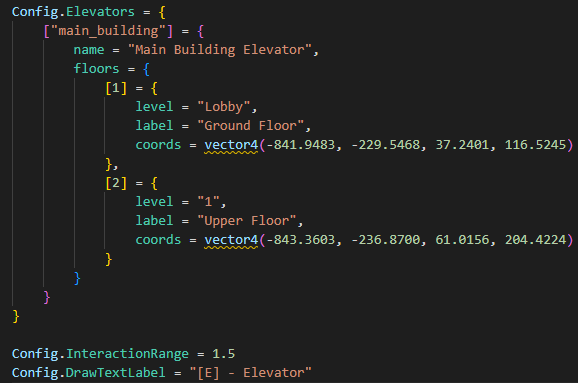

# Fivem Elevator Script🛗

A highly optimized, modern, and realistic elevator system for QBCore frameworks.

### Preview (Görseller)

  

### Config

  

## Features (Özellikler)

### English
- **0.00ms Performance**: Perfectly optimized.
- **Skeuomorphic UI**: Realistic brushed metal panel.
- **Dynamic Scroll**: Automatically adds a scrollbar if the number of floors exceeds the screen limit.

### Türkçe
- **0.00ms Performans**: Kusursuz optimizasyon.
- **Gerçekçi Tasarım**: Dijital LED ekran ve parlayan asansör butonları.
- **Akıllı Kaydırma**: Kat sayısı ekranı aşarsa otomatik ve şık bir kaydırma çubuğu.

## Installation (Kurulum)
1. Drop the `zur-elevator` folder into your `resources` directory.
2. Add `ensure zur-elevator` to your `server.cfg`.
3. Configure your elevators in `shared/config.lua`.
